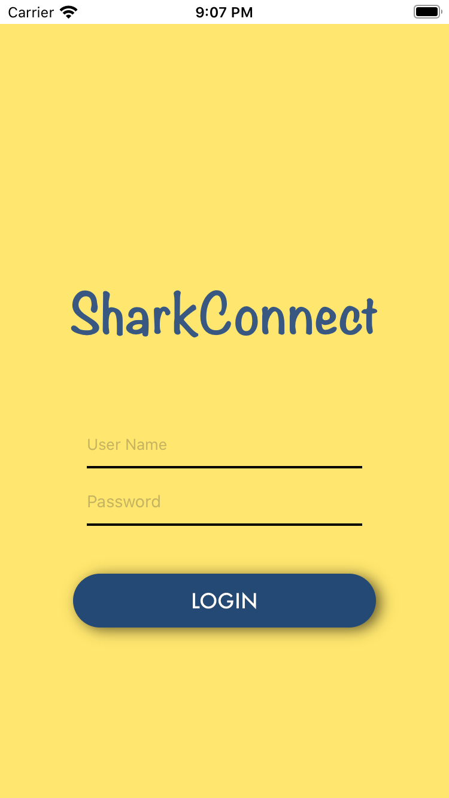
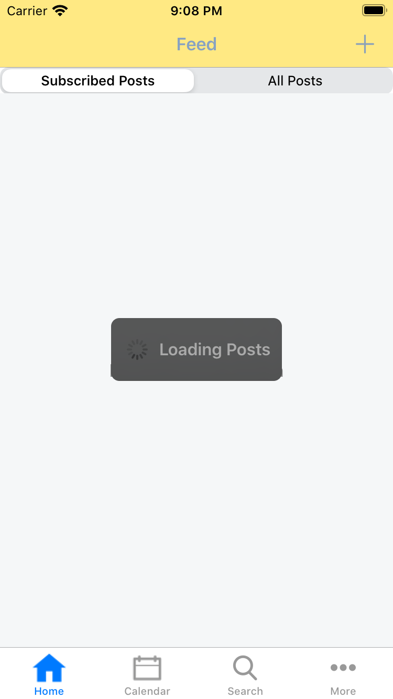
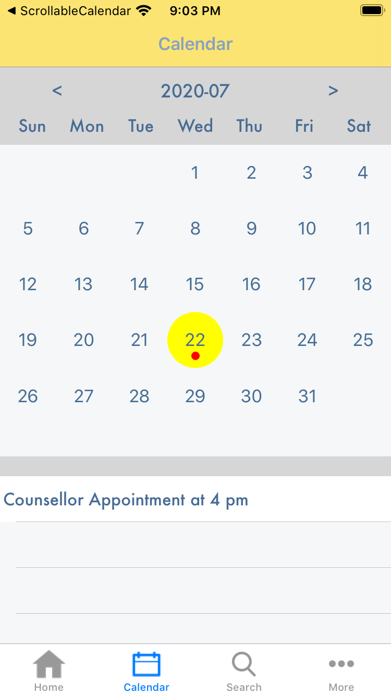
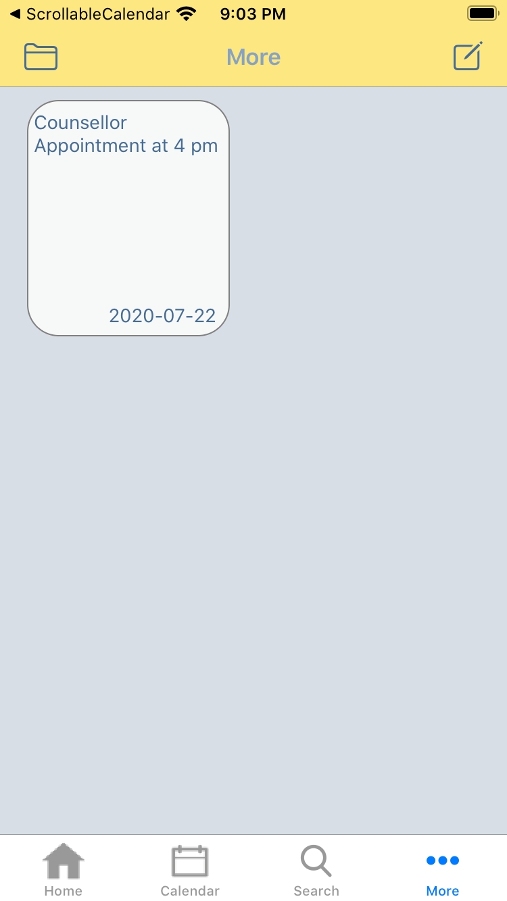

# Sharkconnect Demo

#### Sharkconnect is a content crowdsourcing platform in a high school setting, where club presidents and school admins post school-related contents, which are then shared among students. The app also integrates planning tools for students. Main features include content posting, club searching, calendar, and note-taking tool.

The project is written in Swift 4.

Use https://appetize.io to view the app.

Procedure:  
1. Go to https://appetize.io  
2. At the top tab bar, select "Upload"  
3. Click "Select file", and upload IDK.zip  
4. Enter email and click "Generate"  

username: student  
password: student  
